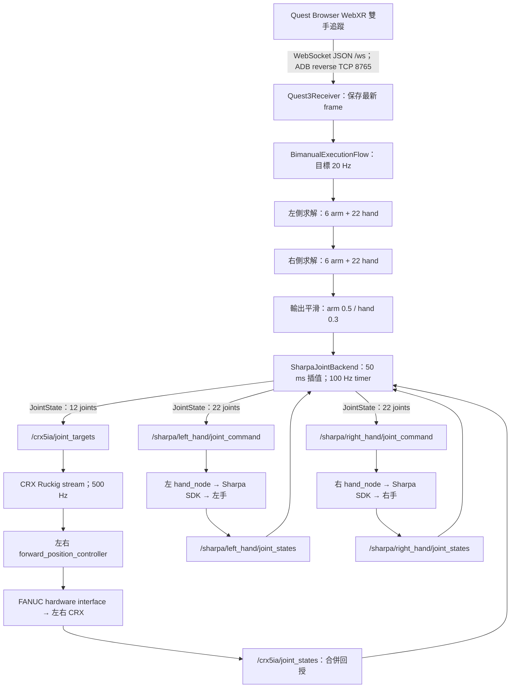

# CRX + Sharpa 遙操作延遲與通訊調查

調查日期：2026-09-28。依據本機工作樹：`retargeting_crx` HEAD `b22e860`、`dual_crx_control` HEAD `4ab8c85`、`dual_sharpa_wave_ros2` HEAD `09e6feb`。HEAD 僅用於定位版本，實際分析包含當下工作樹內容。

## 結論

**目前最有證據的差異是：加入 CRX 後，每側改成手臂與手部一起求解，兩側又依序執行；手指必須等整批求解完成才有新目標。** 本次不連設備的比較中，純雙手求解中位數約 **18.7 ms**，CRX + 雙手約 **39.6 ms**，增加約 **21 ms**；合併模式約 21–23% 的測量樣本超過 20 Hz 對應的 50 ms 預算。

此外，手指指令本身還經過 **20 Hz 更新、alpha=0.3 平滑、50 ms 線性插值，以及 Sharpa SDK 插值／速度設定**。因此 `--publish-hz 100` 代表每 10 ms 發布一次中間值，並不代表每 10 ms 求解一次新手勢。

**手指沒有經過 FANUC 控制器或 CRX 的 Ruckig 插值。** 三個命令 topic 分開發布；CRX 對手指的影響主要是上游求解成本、共用程式資源及回授健康檢查，而不是手指資料繞過手臂控制器。

尚未取得實機時間序列，因此無法宣稱已測出整體延遲、DDS 傳輸延遲或 SDK 內部延遲。本次只新增這份文件，沒有修改控制程式、參數或啟動 ROS／Quest／viewer／硬體。

## 調查範圍與比較基準

使用者的 retargeting 指令：

```bash
.venv/bin/python scripts/run_crx_sharpa_joint_teleop.py \
  --backend ros --command-hz 20 --publish-hz 100 --interpolation-horizon-ms 50
```

機器人端指令：

```bash
ros2 launch dual_crx_control dual_arm.launch.py \
  mock:=false rviz:=true input_rate_hz:=100.0
ros2 launch dual_sharpa_wave dual_sharpa.launch.py backend:=sharpa_sdk
```

本機對應工作區實際是 `~/ws_fanuc`，兩個 package 位於：

- `~/ws_fanuc/src/dual_crx_control`
- `~/ws_fanuc/src/dual_sharpa_wave_ros2`（ROS package 名稱是 `dual_sharpa_wave`）

本機 install 中的 CRX launch 連到 source；Sharpa hardware YAML 經 build 連回 source，且比對內容相同。但使用者執行終端的 overlay、參數覆寫及實際 ROS graph 尚未查證。

「單獨 Sharpa」的完整指令尚待確認，本報告先以 `scripts/run_sharpa_joint_teleop.py --backend ros` 為主要比較對象：它與合併腳本共用 `sharpa_teleop.main()`，只差 `with_arms=False/True`。若原比較對象是 SDK 直接控制或 ROS GUI／波形腳本，則那些路徑會省去 Quest、retargeting 求解及其平滑／插值，差異自然更大。單獨 `dual_sharpa.launch.py` 只啟動驅動，並不產生手勢目標。

## 現在如何建立通訊



### 1. Quest 到 retargeting

`Quest3BimanualOnlineInput.open()` 啟動 USB session、ADB reverse 與本機 WebXR receiver。Browser 以 WebSocket 傳送同一 frame 的左右手；decoder 將 WebXR 關節轉成 retargeting 使用的 21 點手部資料。接收端保存最新 frame，不在求解端逐筆補算舊 frame。

主迴圈以 `--command-hz` 排程讀取、映射、求解；兩手要同時有效。輸入 freshness 預設 150 ms，求解完成後也重新檢查。這個年齡由桌面端收到封包開始算，**不包含 Quest 追蹤、Browser 或收到封包以前的傳輸時間**。

### 2. retargeting 到 ROS

`SharpaJointBackend` 建立 `/retargeting_sharpa_joint` node，以背景 `SingleThreadedExecutor` 處理回授、watchdog 及輸出 timer。ROS 2 透過所選 RMW／DDS 做 discovery 與 topic 通訊；實際走本機共享記憶體或網路、選用哪種 RMW，不能僅從腳本判定。不同終端需有相容的 ROS domain、discovery 範圍與 QoS。

此路徑是 **直接發布 JointState**；沒有使用另一套 `dual_crx_ros2` gateway 的 lease、`TeleopCommand` 或 enable service。不可把其他 CRX backend 的說明套在這兩支 Sharpa 腳本上。

| 方向 | Topic | 資料與名義頻率 |
| --- | --- | --- |
| 發送雙臂 | `/crx5ia/joint_targets` | `sensor_msgs/msg/JointState`；`left_J1..J6`、`right_J1..J6`，12 個 rad；100 Hz |
| 發送左手 | `/sharpa/left_hand/joint_command` | `JointState`；22 個 `left_*` 關節，rad；100 Hz |
| 發送右手 | `/sharpa/right_hand/joint_command` | `JointState`；22 個 `right_*` 關節，rad；100 Hz |
| 接收雙臂 | `/crx5ia/joint_states` | 左右 controller 回授由 merger 合併；100 Hz 設定 |
| 接收雙手 | `/sharpa/{left,right}_hand/joint_states` | 每隻 hand node 的量測角度，rad；100 Hz 設定 |

retargeting pub/sub 與 Sharpa driver 使用 `KEEP_LAST(depth=1), RELIABLE, VOLATILE`。depth=1 減少應用層舊訊息排隊，但不保證零延遲或 real-time deadline，也不排除 DDS／SDK 內部等待。

啟動時最多等待 5 秒，要求所有使用中 channel 有完整且新鮮的回授，以及命令 subscriber。合併模式等待三路，純雙手模式等待兩路。校正及插值起點使用量測姿態。這是啟動條件，正常運行不會每筆等待機器人到位或回覆 ack。

每次求解完成只替換一個 pending target。100 Hz timer 對完整 56 維向量取樣，再依序發布三個 channel，使用同一 ROS timestamp；**不同 topic 並非原子、同步到達的傳輸**。timer 不會把錯過的時槽補發成一串舊命令。

### 3. ROS 到 Sharpa

launch 為左右手各啟動一個獨立 `hand_node` 程序，以 hardware YAML 中明確指定的 serial number 連接各自裝置。

連線流程：`SharpaWaveManager.get_instance()` → discovery 等待指定 serial → `connect(serial)` → POSITION mode → speed/current coefficient → SDK control source → `start()` → 讀取回授。

收到 `joint_command` 時，`HandNode._on_command()` 驗證並依關節名稱排序，立即呼叫 adapter；adapter 再轉成 SDK 關節順序，呼叫 `set_joint_position(radians, interpolation)`。**沒有刻意等下一個 100 Hz feedback timer 才寫入命令。**

feedback timer 執行 `get_joint_position_degree()`，轉成 rad 和 URDF 關節順序後發布；timestamp 是 node 讀回後蓋上的時間，並非已證明的馬達採樣時間。命令 callback 與 feedback timer 共用該 node 的 executor，因此 SDK 同步讀／寫若阻塞，另一個 callback 也會受影響。

目前 hardware YAML：

| 參數 | 左右手值 | 意義 |
| --- | --- | --- |
| `publish_rate_hz` | `100.0` | 回授／update timer，不是命令限速器 |
| `speed_coeff` | `0.3` | SDK 速度係數；不能直接換算成固定延遲或 rad/s |
| `current_coeff` | `0.6` | SDK 電流係數 |
| `interpolation` | `true` | 每次寫入都啟用 SDK 插值 |
| `command_timeout_sec` | `0.0` | driver 命令 timeout 關閉，與上游 watchdog 不同 |

ROS adapter 只指定 serial，裝置 discovery、實體網路連線與內部排程由 SDK 管理。安裝的 SDK header 有 Ethernet／TCP 相關介面與錯誤定義，但未提供足夠資訊證明本次關節命令的完整 wire protocol、port 或緩衝策略；本次也沒有初始化 SDK 或擷取封包。

### 4. ROS 到 CRX

`/crx5ia/joint_targets` → `joint_interpolation` → `/crx5ia/{left,right}/forward_position_controller/commands`（`Float64MultiArray`）→ 各自 500 Hz `controller_manager` → FANUC hardware interface。

**以目前 launch 的可執行設定為準，使用者指令實際選到 `method=ruckig`、`ruckig_target_mode=stream`、timeout 0.2 秒。** 檔頭仍有 waypoint 預設／stream opt-in 的舊說明，與 `DeclareLaunchArgument` 不一致。`input_rate_hz=100` 是上游參考週期 10 ms，並不把輸出設定為 100 Hz；插值與 controller 設定皆為 500 Hz。Ruckig 的速度、加速度、jerk 限制影響手臂，不直接處理手指。

實體 driver 使用 Stream Motion（程式中為 UDP，Xacro 預設 port `60015`）與 RMI（TCP，這份 Xacro 預設連線 port `16001`，RMI 握手後可轉到 controller 回傳的 port）。目前 launch 實際預設 IP 是左 `192.168.2.100`、右 `192.168.1.100`；檔頭示例 IP 也與實際宣告不同。以上是程式預設，沒有確認現場連線或控制器內部伺服頻率。

## 延遲來源：哪些已確認、哪些仍需量測

### A. 加入手臂後，手指等更久才取得新目標：已由離線比較支持

純雙手每側是 22 維，合併模式每側是 28 維。`BimanualRetargetingPipeline.step()` 先左側 `solve()`，再右側 `solve()`，兩側都完成後才返回。每側是 joint retargeting，沒有獨立的高速手指求解迴圈。

`build_flow()` 給每側 NLopt `maxtime=0.025` 秒：這是求解器時間預算，不是整批硬性 50 ms 上限，也不是固定等待 25 ms。mapping、Python callback、filter、viewer 等都有額外成本。主迴圈超時後採 `max(原本起點 + period, 現在時間)` 排下一輪，並有 2 ms sleep；不會為維持 20 Hz 補算漏掉的 frame。

合併 profile 還增加了世界座標拇指與腕部旋轉目標（左側例：`world_thumb` 0 → 10、`wrist_rotation` 0 → 0.1），所以不只是多傳 12 個數值，優化問題本身也不同。輸出平滑結果會作為下一輪 `previous_qpos`；objective 有對前一姿態的正則化，可能進一步影響快速變化時的收斂與追蹤，需要以真實手勢驗證。

### B. alpha=0.3 帶來明顯跟隨滯後：兩支 retargeting 腳本共同存在

手指每個新求解目標只濾波一次：

```text
filtered[k] = 0.3 * raw[k] + 0.7 * filtered[k-1]
```

假設 raw target 瞬間跳到固定新值，7 次更新才超過 90%，9 次更新才超過 95%。以 20 Hz 計，從第一次更新到第 7／9 次分別跨 300／400 ms，還需考慮第一次更新前的等待及後續插值。這是階躍響應的漸進收斂，不是每筆固定延後 300 ms。

對緩慢變化訊號，這個 filter 的低頻等效延遲約 `(1-alpha)/alpha * T`：20 Hz 時約 **117 ms**；若實際只剩 15 Hz，約 **156 ms**。因此合併求解一旦降低有效目標頻率，相同 alpha 在真實時間上會更慢。這些是 filter 模型推算，並非實機延遲量測。

兩份 bimanual YAML 都是 hand alpha=0.3、arm alpha=0.5，所以不能只以平滑存在解釋兩支腳本的差異。當前 `limit_joint_speed=false`，profile 內的 `max_joint_speed` 不會在這條 retargeting 路徑額外形成速度限制。

### C. 50 ms 插值與 SDK 插值：已確認有兩層，內部效應未量測

上游線性插值從最近發布的位置走向新目標，終點時間是 `backend.execute()` 收到目標的時間加 50 ms。正常 timer 下，第一筆變化通常等到接下來的 10 ms tick；新目標可中途取代原 segment。這不是固定 50 ms 的資料佇列，也不應把「tick 等待」和完整 50 ms 無條件相加。

SDK 收到的已是插值後目標，卻仍傳入 `interpolation=True`。SDK 是否重新規劃每個 target、是否有固定緩衝、100 Hz 更新與 speed coefficient 如何交互作用，目前 adapter／header 無法回答。若純雙手用相同 driver，此 SDK 層也是共同因素。

只提高 `--publish-hz` 不會縮短手部 filter 的時間尺度，也不會加速求解。CLI 要求 horizon 大於 0；不能用 `--interpolation-horizon-ms 0` 關閉插值。過短 horizon 若在 timer 處理前已到期，會被拒絕並暫停輸出，因此也不能任意降到小於 10 ms。

### D. Viewer／CPU／Python 排程：合理候選，尚未量測

原指令未指定 `--no-viewer`，所以 retargeting 預設啟用 Viser；CRX launch 又啟用 RViz。`BimanualExecutionVisualizer.update()` 直接掛在 flow observer，更新模型 FK、mesh pose 和人手顯示，位於本輪發布目標之後、下一輪求解之前。模型變大會增加工作量；solver 的 Python callback、背景 ROS timer 與 viewer 也可能競爭 CPU／GIL。

`solve_ms` 只涵蓋 `pipeline.step()`，不含 observer 或整個週期，因此只看它不能排除 viewer 造成的降頻。本次 benchmark 沒有啟動 viewer，也沒有量測 GIL 或 DDS callback 排程。

### E. 暫停／恢復可能被感覺成 delay：合併模式多一個 CRX 回授依賴

backend 檢查所有 channel：回授缺失、凍結或超過 500 ms，以及命令 subscriber 消失，都會暫停整組輸出；合併模式的 CRX 回授異常因此會連帶停手指。新求解目標超過 250 ms 未更新也會暫停，100 Hz 重複發布不會延長舊目標壽命。

Quest 任一手缺失／沒有新鮮 frame 會進入 hold；恢復要求持續有效約 300 ms，再重校正並讀取新 frame。求解後超過 150 ms 的 frame 會丟棄、增加 `stale`。這些情況更像間歇卡住或整組停頓，與持續平滑落後要分開診斷。

## 本次離線驗證

以現有 `SyntheticBimanualInput` 和真正的左右 solver，在本機 `.venv` 做純 CPU 比較。每輪 120 frame，前 20 frame 不計入耗時統計，後 100 frame 記錄 `flow.last_solve_ms`；順序為手、合併、合併、手。兩種模式均維持預設 25 ms／側預算及輸出平滑。

| 模式／輪次 | 求解 p50 | p95 | 最大 | 大於 50 ms |
| --- | --- | --- | --- | --- |
| 純雙手 1 | 18.64 ms | 25.84 ms | 29.98 ms | 0/100 |
| CRX + 雙手 1 | 39.44 ms | 51.60 ms | 51.82 ms | 21/100 |
| CRX + 雙手 2 | 39.78 ms | 51.60 ms | 51.78 ms | 23/100 |
| 純雙手 2 | 18.71 ms | 25.60 ms | 30.55 ms | 0/100 |

每輪均完成 120 commands，`stale=0`。這是直接呼叫 `flow.step()` 的計算耗時，沒有 20 Hz pacing、ROS timer、USB、SDK、機器人或 viewer；**不是實際 command Hz，也不是端到端延遲**。合成資料主要是固定手腕下的手指彎曲，真實手腕移動及追蹤品質會改變結果。

可在 repository 根目錄重現（不連設備）：

```bash
env -u PYTHONPATH .venv/bin/python - <<'PY'
from types import SimpleNamespace
import numpy as np
from retargeting_apps.sharpa_teleop import build_flow
from teleoperation.inputs.synthetic_hand import SyntheticBimanualInput

args = SimpleNamespace(config=None, backend='preview', duration=0.,
    command_hz=20., adb=None, serial=None, viewer=False, viewer_port=9219)
for arms in (False, True, True, False):
    source = SyntheticBimanualInput(frames=120)
    flow, _ = build_flow(args, with_arms=arms, source=source)
    source.open()
    times = []
    try:
        for i in range(120):
            flow.step(source.read())
            if i >= 20:
                times.append(flow.last_solve_ms)
    finally:
        source.close()
    print('arms=', arms, 'p50/p95/max=', np.percentile(times, [50, 95, 100]),
          'over50=', sum(t > 50 for t in times),
          'commands=', flow.command_count, 'stale=', flow.stale_count)
PY
```

另外執行以下既有 headless tests：**61 passed，無 skip**。

```bash
env -u PYTHONPATH .venv/bin/python -m pytest \
  tests/test_sharpa_execution.py tests/test_sharpa_interpolation.py \
  tests/test_bimanual_execution.py -q
```

它們驗證實際 solver 組合、平滑、插值與暫停／恢復邏輯，不驗證硬體或 ROS 網路時間。

## 平行求解評估與後續時限選擇

**目前決議：後續 thread 平行化先評估每側 35–40 ms 的求解時限；本次只記錄方案，尚未開始實作。** 現有 runtime 仍是左右依序求解、每側 `maxtime=0.025` 秒。35–40 ms 尚未作為實際 runtime 設定測試，也不是已驗證的最佳值。

### 可平行化的範圍

左右側各自建立 retargeter、NLopt optimizer 和 Pinocchio model/data；本次離線檢查也確認左右不是同一個 optimizer／model instance。因此可以考慮用常駐 `ThreadPoolExecutor(max_workers=2)`，同時處理同一 Quest frame 的左側與右側求解，再匯合結果做平滑與發布。

這裡的工作單位是「左 CRX + 左手」及「右 CRX + 右手」，並未把同一側的手臂和手指拆成不同優化問題。單一 optimizer 內含可變 callback、FK data、暫存陣列與 `previous_qpos`，不能同時處理前後兩幀。

### 已完成的 thread 局部比較

在合併模型中，先用合成輸入執行 20 frame，取下一 frame 的左右 observation，保存各側 seed；每次比較都使用相同 observation 和 seed。以常駐兩個 worker 對照依序呼叫 `solve()`，順序皆為依序、thread、thread、依序。沒有 ROS、viewer 或設備，也沒有修改專案程式。

| 條件 | 依序整批 p50 | thread 整批 p50 | thread 整批 p95 | 每側 objective 評估次數中位數 |
| --- | --- | --- | --- | --- |
| 每側保留 25 ms 時限 | 39.58–39.82 ms | 26.13–26.26 ms | 26.40–26.51 ms | 依序左 42／右 41；thread 左右各 33 |
| 僅實驗物件取消時限，維持原收斂條件 | 40.45–40.52 ms | 35.21–35.56 ms | 36.42–37.20 ms | 兩種方式皆左 42／右 43 |

25 ms 組每輪執行 35 次、排除前 5 次；取消時限組每輪 25 次、排除前 5 次。表中範圍是兩輪結果，不是信賴區間。

保留 25 ms 時限時，依序 objective cost 約為左右各 `0.073917`，thread 約為左 `0.074215`／右 `0.074210`；較短整批時間伴隨較少評估及略高 cost，不能全部視為同品質的加速。取消時限組的評估次數和最終 cost 一致，與依序基準相比最大輸出角度差為 `0 rad`，局部耗時改善約 12–13%。這些數字只代表該固定合成姿態，不代表完整動作序列或實機表現。

### 為何 thread 下要評估 35–40 ms

NLopt 的 `maxtime` 是每個 solver 經過的 wall-clock 時間，不是獨占 CPU 計算時間；等待 GIL 和 CPU 排程也會消耗預算。此 objective 每輪會回到 Python，執行 FK／Jacobian、PyTorch loss 及梯度操作。部分原生運算能釋放 GIL，但 Python callback 仍會競爭，所以兩個 thread 無法保證全程同時運算。上述實驗支持存在競爭，但沒有對 GIL 等待時間做獨立 profiling。

同收斂結果的 thread 整批約 35–37 ms，支持將 **35 ms／側與 40 ms／側** 作為後續測試候選，保留 25 ms／側作對照。時限是允許的上限，提早收斂就會返回；它不是固定等待時間，也不保證嚴格 deadline，單次 callback 及排程可能使實際耗時超過設定。

兩側平行後，整批時間應以實際 submit 到兩側完成量測；有有效重疊時接近較慢一側的經過時間加上派工／匯合成本，不能直接把 40 + 40 當作 80 ms，也不能保證整批一定小於 40 ms。20 Hz 只有 50 ms 週期，必須另外保留 mapping、filter、viewer、ROS 競爭與排程餘裕。

後續驗證應同時比較：整批及完整週期的 p50／p95、超過 50 ms 的比例、有效目標 Hz、`stale`／pause、objective 評估次數，以及追蹤誤差和輸出品質。不要只用更短耗時判定方案成功；姿態變化序列、手腕運動及 viewer／ROS 負載也需涵蓋。

### 未來實作需要保留的行為

- 常駐 worker，避免每幀重新建立 thread；每側同時只允許一個 solve。
- 同一 frame 的左右結果完成後才匯合；reset、校正、filter 及 `previous_qpos` 更新不可與該側 solve 重疊。
- 維持最新 frame 語意，不累積舊工作；求解後 freshness 檢查、tracking pause、stop 與錯誤傳遞仍要生效。
- ROS timer／watchdog 保留原有責任；一側 worker 失敗時不可任意發布另一側未配對的結果。

兩個常駐 process 是另一個候選：各自建立一側 solver，可避開 Python GIL 的共用，但增加初始化、資料傳輸及狀態同步成本；本次未做 process benchmark。若後續比較 process，先保留 25 ms／側重測，再依品質與耗時決定是否提高。無論採用哪種並行方式，hand alpha=0.3 與 50 ms 插值的跟隨滯後仍需另外評估。

## 下一步如何定位實機差異

以下為建議，本次沒有執行。

1. **固定比較條件。** 確認純 Sharpa 完整指令，兩次維持相同手部 driver、20/100 Hz、50 ms horizon、手勢及 viewer 設定。記錄 `commands` 每段時間的增量、`solve_ms`、`stale`、`paused`；`commands` 是 solver 目標數，不是 ROS 發布數。
2. **先比較顯示負載。** 在相同控制參數下比較 retargeting `--no-viewer`，以及 CRX `rviz:=false`。如果差異縮小，再調整顯示更新方式；這比直接更改馬達參數更能隔離因素。
3. **同時量測命令與回授。** `ros2 topic hz` 只能看訊息到達頻率，即使 100 Hz 正常，也可能一直發相同／緩慢變化的 target。要比較同一關節的 `joint_command.position` 與 `joint_states.position`，用小幅週期動作的相位差或互相關估計「ROS 命令到量測位置」的跟隨時間。這仍包含 SDK、馬達及 feedback 採樣延遲。
4. **把上游延遲分段。** 若增加量測欄位，記錄 host input receive、左右 solve 起訖、raw/filter target、`backend.execute`、ROS publish、hand callback 開始／SDK 寫入返回及 SDK 讀回時間。現有 command header 是發布時間，無法反推出 Quest frame 的年齡。跨主機須同步時鐘；Browser、host monotonic、ROS clock 不可直接相減。CRX `/crx5ia/interpolated_joint_commands` 診斷訊息使用 monotonic timestamp，也不可直接與 ROS clock header 相減。
5. **依證據調參。** 若主要是上游 filter，先在 preview／mock 單獨提高 hand alpha，觀察抖動，再單獨縮短 horizon；兩個參數目前都不是手指專用 CLI（horizon 會影響全部 joints）。若要只調 hand alpha，可用 `--config` 的 bimanual `output` 覆寫並保留完整 output 欄位，因目前採淺層 update。若 delay 發生在 `joint_command → joint_states`，再檢查 SDK callback 耗時、插值與速度係數。沒有實測前不建議直接關掉 SDK 插值或提高硬體速度。
6. **若仍由合併求解主導，評估平行化或降低計算成本。** 已記錄的下一步是左右 thread 平行求解、每側 35–40 ms 候選時限，詳見上一節；尚未實作。將同一側手指與手臂求解／發布排程分離則是更進一步的架構變更，涉及腕部目標耦合、校正和一致性，需要另行設計驗證。單純把 `--command-hz` 改成 100，不會讓約 40–52 ms 的計算塞進 10 ms。

現場可使用的唯讀檢查例子（需在原本已啟動的 ROS 環境執行）：

```bash
ros2 pkg prefix dual_crx_control
ros2 pkg prefix dual_sharpa_wave
ros2 param get /crx5ia/joint_interpolation method
ros2 param get /crx5ia/joint_interpolation ruckig_target_mode
ros2 param get /sharpa/left_hand/hand_node interpolation
ros2 param get /sharpa/left_hand/hand_node speed_coeff
ros2 topic info /sharpa/left_hand/joint_command --verbose
ros2 topic hz /sharpa/left_hand/joint_command
ros2 topic hz /sharpa/right_hand/joint_command
ros2 topic hz /crx5ia/joint_targets
```

`topic hz` 各自執行、量完停止；必要時對左右 `joint_states` 做同樣量測。若為多機環境，還要核對 `ROS_DOMAIN_ID`、`RMW_IMPLEMENTATION`、discovery 設定及時鐘同步。

## 原始碼索引

| 問題 | 主要來源 |
| --- | --- |
| 兩支腳本差異、25 ms 預算、CLI 預設 | [sharpa_teleop.py](../src/retargeting_apps/sharpa_teleop.py)：`build_flow`、`main` |
| 左右依序求解 | [bimanual.py](../src/teleoperation/bimanual.py)：`BimanualRetargetingPipeline.step` |
| 排程、丟棄過期結果、恢復、統計 | [bimanual_execution.py](../src/teleoperation/bimanual_execution.py)：`step`、`run` |
| alpha 濾波公式 | [output.py](../src/teleoperation/output.py)：`QposOutputFilter.apply` |
| 兩份平滑設定 | [crx5ia_sharpa_wave.yaml](../configs/bimanual/crx5ia_sharpa_wave.yaml)、[sharpa_wave.yaml](../configs/bimanual/sharpa_wave.yaml) |
| profile 與目標差異 | [合併左側 profile](../configs/retargeting_profiles/vector_wrist_joint_crx5ia_sharpa_wave_left.yaml)、[純手左側 profile](../configs/retargeting_profiles/vector_wrist_joint_sharpa_wave_left.yaml)；右側有對應檔案 |
| topic、QoS、timer、回授檢查 | [sharpa_joint.py](../src/retargeting_ros/sharpa_joint.py)：`SharpaJointBackend` |
| 插值的起點與終點時間 | [joint_interpolation.py](../src/retargeting_ros/joint_interpolation.py)：`set_target`、`sample` |
| Quest 最新 frame 與 freshness | [receiver.py](../src/teleoperation/inputs/quest3/receiver.py)、[online.py](../src/teleoperation/inputs/quest3/online.py) |
| viewer 在主迴圈的工作 | [bimanual visualizer](../src/retargeting_apps/visualization/execution/bimanual.py)：`update` |
| Sharpa launch／實機設定 | [dual_sharpa.launch.py](../../ws_fanuc/src/dual_sharpa_wave_ros2/launch/dual_sharpa.launch.py)、[hardware YAML](../../ws_fanuc/src/dual_sharpa_wave_ros2/config/dual_sharpa_hardware.yaml) |
| 收到命令即寫 SDK、timer 讀回授 | [hand_node.py](../../ws_fanuc/src/dual_sharpa_wave_ros2/dual_sharpa_wave/hand_node.py)、[sharpa_sdk_hand.py](../../ws_fanuc/src/dual_sharpa_wave_ros2/dual_sharpa_wave/sharpa_sdk_hand.py) |
| CRX launch 實際預設 | [dual_arm.launch.py](../../ws_fanuc/src/dual_crx_control/launch/dual_arm.launch.py)：`generate_launch_description` |
| CRX 插值與 controller 頻率 | [interpolation/node.py](../../ws_fanuc/src/dual_crx_control/src/dual_crx_control/interpolation/node.py)、[controllers YAML](../../ws_fanuc/src/dual_crx_control/config/dual_arm_controllers.yaml) |
| FANUC port／transport | [crx5ia Xacro](../../ws_fanuc/src/fanuc_driver/fanuc_hardware_interface/robot/crx5ia.urdf.xacro)、[stream.cpp](../../ws_fanuc/src/fanuc_driver/fanuc_libs/stream_motion/src/stream.cpp)、[rmi.cpp](../../ws_fanuc/src/fanuc_driver/fanuc_libs/rmi/src/rmi.cpp) |

外部 workspace 連結按目前 `~/retargeting_crx` 與 `~/ws_fanuc` 並列的目錄結構建立。
